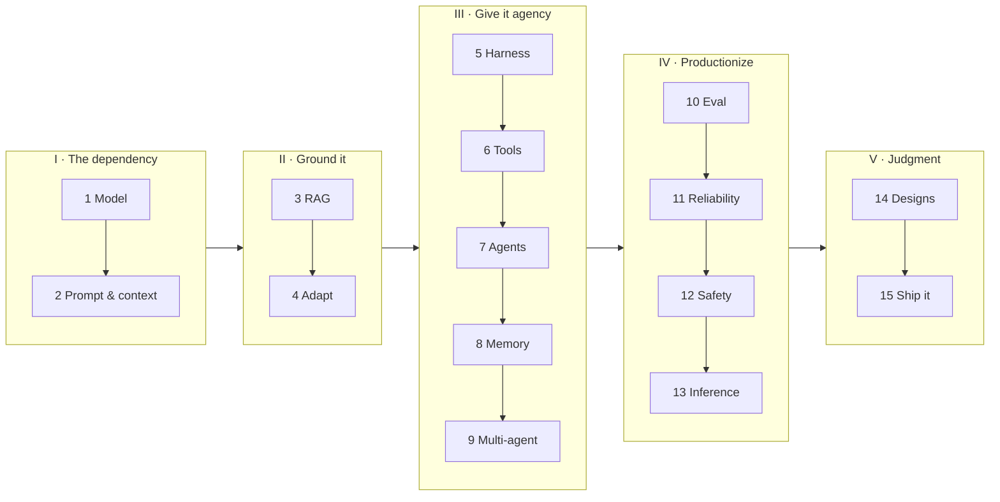

# Working with LLMs in Production — an engineer's guide

*The overview. Read this first: it gives you the one idea the whole guide hangs
off, the example we'll build chapter by chapter, and the map.*

---

## Who this is for, and the one idea

This is for a software engineer who has to **build and operate** something on top
of a large language model — not train one. You will not find loss functions or
attention math here except where they change a decision you have to make.

Everything in this guide follows from a single sentence:

> **You have taken a dependency on something non-deterministic, expensive,
> rate-limited, occasionally unavailable, and silently replaced by its vendor.**

Read that again, because nearly every good engineering answer in this space is a
consequence of it. Non-deterministic → you need evaluation, not unit tests.
Expensive and rate-limited → cost and quotas are architecture, not an afterthought.
Occasionally unavailable → fallbacks and timeouts. Silently replaced → you pin
versions and monitor for drift. The model is a *dependency*, and you already know
how to engineer around difficult dependencies.

## The example we'll build: the Helpdesk Copilot

Abstract advice slides off. So one system runs through every chapter — a
**Helpdesk Copilot** for a SaaS product — and each chapter advances it and hits
the next real problem:

- It answers a question, and is mysteriously 6× slower at launch than in the demo → **how the model actually works**.
- It gives different answers to the same question → **prompting and context**.
- It confidently invents a refund policy → **retrieval (RAG)**.
- Docs alone can't fix its tone and format → **adapting the model**.
- It needs to remember customers and *do* things → **the harness, tools, agents, memory**.
- One brain can't hold every skill → **multi-agent**.
- We can't tell if a change broke it → **evaluation**.
- Launch traffic brings 429s and a scary bill → **reliability, cost, safety**.
- We consider self-hosting → **inference infrastructure**.
- Finally we put it all together and ship it → **reference designs, deploy**.

By the end you could stand this system up yourself.

## The map

| Part | Chapters |
|---|---|
| **I — The dependency** | 1 What the model actually is · 2 Prompting & context engineering |
| **II — Ground it in your data** | 3 Retrieval & RAG · 4 Adapting the model |
| **III — Give it agency** | 5 The Harness · 6 Tools & integration · 7 Agent architectures · 8 Memory & state · 9 Multi-agent systems |
| **IV — Make it production-grade** | 10 Evaluation · 11 Reliability, observability & cost · 12 Safety & security · 13 Inference infrastructure |
| **V — Judgment** | 14 Reference designs · 15 Ship it — build & deploy |

## How to read this

Two layers, by design:

- **This guide** (`agentic-ai/guide/`) is the *understanding* layer — narrative,
  connected, one example throughout. Read it front to back.
- **The card files** (`agentic-ai/a01`–`a13`) are the *retention* layer — the same
  material as terse, drillable flashcards fed to the spaced-repetition tool. Each
  chapter ends with a link to its cards.

Read here to understand *why*; drill there to remember. That split — recognition
vs recall — is the whole learning model of this repo.

## The habits that separate strong engineers here

Watch for these; the guide keeps returning to them:

1. **Ask whether you need an agent at all.** Deterministic code is cheaper,
   faster, and testable. "This doesn't need an agent" is a strength.
2. **Treat context as a budget, not a string.** Decide what goes in and what gets
   dropped first.
3. **The model never executes anything.** It *requests*; your runtime *decides*.
   Every permission and safety control lives on your side of that line.
4. **No eval set, no ship.** It's the practice that makes changing an
   LLM system safe.
5. **Commit to a choice, name its trigger and its reversal.** "Workflow now;
   I'd upgrade this step to an agent when X; I'd roll back if Y."

Now, Chapter 1 — what this dependency actually is.
