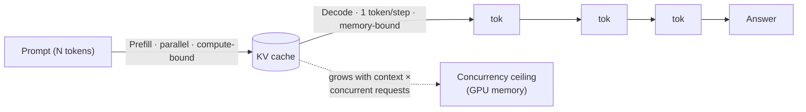

# Chapter 1 — What the model actually is

*Part I of the guide. Before you can design around the model, you have to know
what kind of machine it is. This chapter is the physics; every later decision —
cost, latency, concurrency, caching — is a consequence of it.*

*Copilot status: it answers questions in the demo. At launch it will behave in
ways that only make sense once you understand the engine underneath.*

---

## The mystery that teaches everything

Our Helpdesk Copilot answers a customer in 900ms during the demo and in 6 seconds
at launch. The prompt didn't change. To understand why — and why doubling traffic
made it worse, not just slower — stop thinking of the model as a text box and
start thinking of it as a **two-phase engine with a memory footprint**.

> **The one idea.** The model reads your whole prompt *in parallel* (fast), then
> writes the answer *one token at a time* (slow), and while it writes it holds a
> per-request cache in GPU memory that decides how many customers you can serve
> at once. Cost, latency, and capacity all fall out of that.

## Tokens: the unit everything is priced in

The model doesn't see characters or words; it sees **tokens** — sub-word chunks.
Roughly one token per ¾ of an English word, but code, JSON, and non-English text
inflate that badly: a Korean or deeply-nested-JSON payload can cost 2–3× the
tokens of the "same" English sentence. Every price, every latency figure, every
context limit is denominated in tokens.

The practical consequence: **profile tokens on your real traffic**, not an
average. A cost model built on "average tokens per request" is wrong the moment
your Copilot serves a multilingual or code-pasting user base.

## The context window is a budget, not a capacity

The context window is the maximum tokens a single request can hold — system
prompt + tools + retrieved docs + history + the answer it's about to write. It's
the model's entire working memory; anything outside it does not exist for that
call.

The rookie move is to treat a big window as space to fill. Treat it like a memory
budget instead — because two independent taxes apply as it grows: cost and
latency scale with total tokens, and quality actually *degrades* in the middle of
long contexts (models recall the beginning and end far more reliably than the
middle). "We support 1M tokens" is not "you should use 1M tokens."

## Prefill vs decode: why output is the expensive part

Inference happens in two phases, and telling them apart explains almost every
latency question you'll get.

- **Prefill** processes all input tokens at once. It's compute-bound and fast —
  this is your *time to first token* (TTFT).
- **Decode** generates the answer one token at a time, each conditioned on all
  previous tokens. It's memory-bandwidth-bound and can't be parallelized — this
  is your per-token speed (ITL) and it dominates total time for long answers.

So a *long question with a short answer* (document Q&A) is prefill-bound; a *short
prompt with a long answer* (drafting a reply) is decode-bound. And the single
biggest latency lever is **output length**, not input. Telling the Copilot to
"think step by step" can 5× the output tokens and therefore 5× the generation
time. Budget output explicitly (`max_tokens`, "be concise").

## The KV cache: why your bill is really about concurrency

During decode the model caches the key/value tensors for every token processed so
far, so it doesn't recompute attention each step. That cache — the **KV cache** —
grows with context length × model size, and **every concurrent request needs its
own**. At long context a single request can eat tens of GB of GPU memory.

This is the launch mystery. More traffic means more concurrent KV caches
competing for fixed GPU memory; requests queue, batches swell, and per-request
latency climbs. Nothing "got slower" — you ran out of memory to run people in
parallel. It's also the real economic argument for retrieval over stuffing:
shorter effective context → more concurrent users per GPU → lower cost per query.

## Three latency numbers, not one

"Latency" is really three metrics that move independently:

- **TTFT** — time to first token (prefill-bound). The number users *feel* in a
  streaming UI.
- **ITL** — inter-token latency (decode-bound). How fast text flows once it starts.
- **Total** = TTFT + output_tokens × ITL.

Streaming tokens as they're produced hides decode time behind reading time, which
is why chat UIs stream. Pick your SLO to match the UX: TTFT for interactive,
total throughput for batch jobs.

## It is not deterministic, even at temperature 0

Sampling controls (temperature, top-p, top-k) shape randomness, and it's tempting
to think temperature 0 gives you a pure function. It doesn't — floating-point
non-determinism in batched GPU math can flip near-tied tokens, and the provider
may silently update the model. **Never build anything that assumes identical
output across runs.** This one fact forces evaluation-based testing (Chapter 10)
instead of snapshot assertions, and cache designs that tolerate variation.

## The cost model, and the levers that move it

Per request: `input_tokens × input_price + output_tokens × output_price − cache
savings`. Output tokens cost more (often 2–4×) because of sequential decode. So,
in order of impact:

1. **Cut output tokens** — concise instructions, `max_tokens`, don't emit
   reasoning you don't need.
2. **Prompt-cache the shared prefix** — a stable system prompt and tool
   definitions placed *first* can be reused across requests at a steep discount,
   and cut TTFT. (This inverts normal prompt order: stable stuff first, the
   user's query last.)
3. **Route by difficulty** — send easy tickets to a fast cheap model, escalate
   only hard ones to a reasoning model.

> **Decision — which model tier?** Use a fast instruction-tuned model by default;
> reach for a slow, pricey *reasoning* model only for tasks where a cheaper one
> demonstrably fails (multi-step logic, tricky code). Reasoning models can be
> 5–20× slower and burn thousands of hidden "thinking" tokens — premium tier,
> used selectively, never as the default.

## What breaks in production

- **Assuming temperature 0 is deterministic** → flaky "golden" tests. Test
  semantics, not exact strings.
- **Treating 128K context as free** → the window also holds your prompt, tools,
  history, and output; and quality sags in the middle. Curate, don't stuff.
- **Ignoring output length** → latency and cost blow up on verbose answers. Cap it.
- **Sizing capacity by requests, not KV memory** → you OOM under concurrency and
  can't explain the latency cliff.

## State of the Copilot

We now understand the engine: why it's slow to finish (decode), why it stalls
under load (KV cache), where the money goes (output tokens), and why we can never
trust two runs to match (non-determinism). That last point means our next job is
to control *what we put in* — because a machine this sensitive lives or dies by
its input.

---

### Drill this
Cards for this chapter:
[A1 · LLM Foundations](../a01-llm-foundations-for-engineers.md). Read here for the
mental model; drill there for the specifics.
