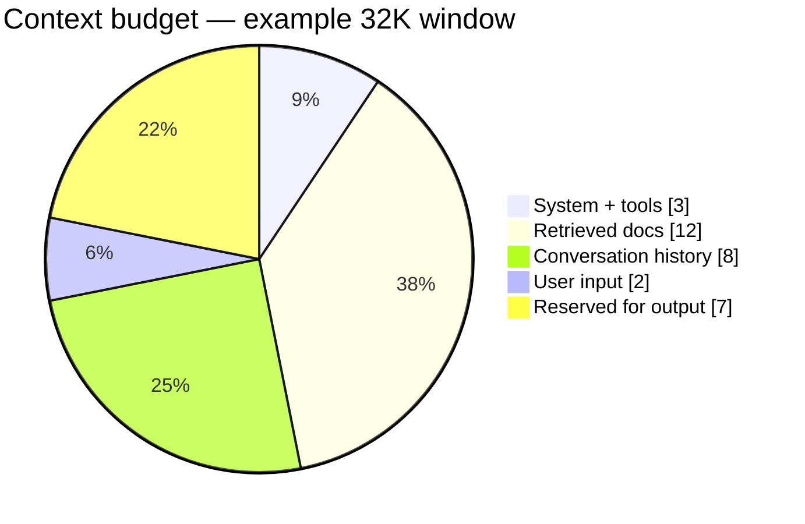

# Chapter 2 — Prompting and context engineering

*Part I of the guide. Chapter 1 showed the model is exquisitely sensitive to its
input. This chapter is about controlling that input deliberately — first as
wording (prompting), then as a managed resource (context engineering).*

*Copilot status: it answers, but inconsistently, and its prompt has quietly grown
into a 2,000-line string nobody wants to touch.*

---

## From "magic words" to a managed resource

Two customers ask the same question and the Copilot gives two different-quality
answers. The instinct is to fiddle with wording — *prompt engineering*. That's
real, but it's the small half. The big half is **context engineering**: the
systems discipline of choosing, ordering, sizing, and versioning *everything*
that lands in the window — instructions, tool definitions, retrieved docs,
conversation history, scratchpad, and the user's input.

> **The one idea.** The prompt is not a string you write; it's a **budget you
> allocate** at runtime. Prompting is picking the words. Context engineering is
> deciding, per request, what gets the tokens and what gets dropped.

## Roles and the instruction hierarchy

Modern chat APIs structure context as typed messages: **system/developer** (the
model's constitution — behaviour, constraints, priority), **user** (the person's
input), **assistant** (prior model turns), **tool** (function results). The model
is trained to weight system instructions above user ones.

That hierarchy is your first, cheapest safety tool: put rules in the system role,
and — critically — put anything *untrusted* (a customer's message, a retrieved
web page) in a *lower-priority* role, clearly fenced as data. It won't stop a
determined injection (Chapter 12), but role separation is where defense begins.

## The prompting techniques worth knowing

- **Zero-shot vs few-shot.** Instructions alone vs instructions plus examples.
  Examples nail format and tone. **Dynamic few-shot** picks the examples at
  runtime by similarity to the current input — maximally relevant, no wasted
  tokens.
- **Chain-of-thought.** Ask the model to reason before answering; it improves
  multi-step accuracy by spending output tokens to "work through" the problem.
  It costs latency and tokens (Chapter 1), and you usually **log the reasoning
  but don't show it** — it often reads as confused even when the answer is right.
- **Structured formatting.** Delimiters (XML-ish tags, headers, fenced blocks)
  tell the model which text is instruction, which is data, which is example.
  Ambiguity is where it goes wrong.
- **Output format + a validation loop.** Specify the exact JSON/enum you want,
  then *validate the output and retry on failure*. This generate→validate→retry
  loop is how you get reliable structured output — remember from Chapter 1 that
  valid JSON is still only *syntactically* guaranteed; you validate the values
  yourself.

## Context as a budget you allocate

Here's the mental shift, made concrete. Every section competes for the same
window, and you assign each a cap:

Set hard caps per section and enforce them. When the assembled context would
overflow, you need a **truncation priority** decided in advance — typically: drop
oldest history first, then lowest-ranked retrieved docs, then few-shot examples;
**never** silently drop system instructions or tool definitions. An engineer who
can state their truncation order has done the real work; one who "just puts it in
the prompt" has not.

## Compaction: making long conversations fit

History grows every turn (and, from Chapter 1, you re-send all of it every time —
the number-one cost surprise). Compaction keeps it inside the budget:

- **Rolling window** — keep the last N turns verbatim, drop the rest. Simple,
  lossy.
- **Summarization** — an LLM compresses older turns into a running summary.
  Cheaper on tokens, but summaries lose detail and can drift.
- **Hierarchical** — summaries at several granularities (turn, topic, session)
  so you can zoom.

The judgment call is *what to keep verbatim vs summarize*: exact wording matters
for the current task and recent turns; older context can usually be compressed.

## Prompts are deployable artifacts

The reason the Copilot's prompt became an untouchable 2,000-line blob is that it
was treated as a constant in the code instead of a versioned artifact. Fix it:

- **Templating with injection-safe interpolation.** Parameterize the prompt;
  treat every interpolated value (user input, retrieved text, tool output) as
  untrusted — fenced in delimiters, in a low-priority role, never concatenated
  raw into instructions.
- **Versioning and a registry.** Store prompts with version numbers and
  changelogs; pin *prompt + model together* (Chapter 1: the model changes under
  you). A prompt tuned on one model can regress on the next.
- **Regression tests + CI gate.** Run prompt changes against a curated input set
  and assert on quality, not exact match (Chapter 10). A one-word edit is a
  high-risk change — the model is brittle to reordering and whitespace.
- **A/B in production.** For real quality shifts, split live traffic between
  variants and compare business metrics, because offline eval never captures
  everything.

> **Decision — how much context to spend?** More context is not more quality past
> a point (lost-in-the-middle, Chapter 1). Start lean, add a section only when an
> eval shows it helps, and always know what you'd drop first under pressure.

## What breaks in production

- **Unversioned prompts** → you can't reproduce or roll back a regression. Version
  and pin.
- **Raw interpolation of user/retrieved text into instructions** → prompt
  injection. Fence and de-privilege it.
- **Casual prompt edits shipped without eval** → silent quality drops; the model's
  brittleness makes "tiny" changes risky.
- **Letting history grow unbounded** → cost and latency creep, then overflow.
  Compact on a policy.

## State of the Copilot

We can now shape the input deliberately: structured, versioned, budgeted,
compacted, injection-fenced. But there's a hole no amount of prompting fills —
the Copilot still *makes up* product facts it was never given. Wording can't
supply knowledge. For that we have to put the right information *into* the
budgeted context at the right moment: retrieval.

---

### Drill this
Cards for this chapter:
[A2 · Prompting & Context Engineering](../a02-prompting-and-context-engineering.md).
