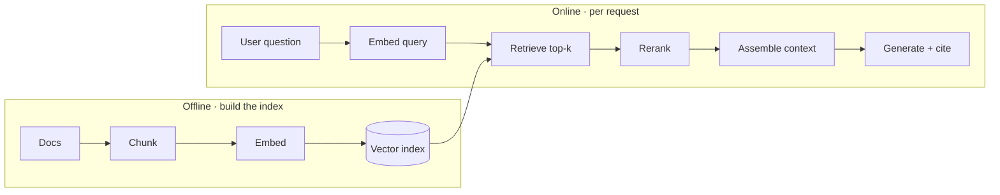

# Chapter 3 — Retrieval and RAG

*Part II of the guide. Prompting shapes how the model uses what it's given; it
can't supply knowledge the model never had. Retrieval-augmented generation (RAG)
is how you feed the right facts into the budgeted context at the right moment.*

*Copilot status: it just told a customer we offer 60-day refunds. We don't. It
wasn't lying — it was pattern-completing a plausible policy. We need to ground it.*

---

## RAG is a retrieval system with an LLM attached

The framing that fixes most RAG failures: **it's an information-retrieval problem
first and a generation problem second.** When a grounded system gives a wrong
answer, the cause is almost always that the right passage was never retrieved, or
a wrong passage was retrieved and the model faithfully summarized garbage.

> **The one idea.** Retrieval is the ceiling on generation. The model can only use
> what you hand it, so quality is capped by what your retriever finds — tune the
> retriever, not the prompt, when answers are wrong.

RAG earns its complexity by buying four things fine-tuning can't: **grounding**
(cite real sources, curb hallucination), **freshness** (update an index, not a
model), **access control** (retrieve only what *this* user may see), and **cost**
(indexing is cheaper than training and scales better than stuffing the whole
corpus into every prompt).

## The pipeline, stage by stage

The power of seeing it as stages is that **each is independently tunable and
independently testable** — which is exactly how you answer "is the problem
retrieval or generation?"

- **Chunk.** Split documents into retrievable units. Too big and a chunk buries
  the relevant sentence in noise (hurts precision and wastes budget); too small
  and it loses the context needed to be meaningful (hurts recall). Respect
  structure — headings, paragraphs — over blind fixed-size splits.
- **Embed.** Turn text into vectors where semantic similarity is geometric
  nearness. The embedding model is a real dependency: change it and **every
  vector in your index must be recomputed**, because old and new vectors aren't
  comparable.
- **Index.** Store vectors in an approximate-nearest-neighbour structure (HNSW is
  the common default) that trades a little recall for a large speed win.
- **Retrieve → rerank.** First-stage retrieval is fast and approximate; a
  second-stage **cross-encoder reranker** re-scores the top candidates more
  precisely. Cheap way to lift precision without re-indexing.

## Where naive RAG falls down, and the fixes

- **Vectors alone miss exact terms.** Semantic search fumbles error codes, SKUs,
  and rare names. **Hybrid search** fuses dense vectors with sparse keyword/BM25
  scoring so you get both meaning and exact-match. For the Copilot, "error
  `E-4021`" must hit the keyword path.
- **The query is bad, not the index.** Users write terse or messy questions.
  **Query understanding** — rewriting, expansion, decomposition into sub-queries,
  or HyDE (retrieve using a hypothetical answer) — fixes retrieval by fixing the
  query.
- **Structured questions aren't retrieval questions.** "How many open tickets does
  this account have?" is a SQL query, not a vector search. Knowing when to route
  to a database (or a graph) instead of embeddings is a senior instinct; vectors
  are for fuzzy semantic recall, not precise filters or aggregates.

## The operational concerns that decide production

Demos ignore these; production lives or dies on them.

- **Access control at retrieval time.** In a multi-tenant Copilot, permission
  filtering must happen *when you retrieve*, not by asking the model to be
  discreet. Filter by tenant/user *before* results reach the context, or you have
  a data leak one prompt-injection away. This is the single most common serious
  RAG bug.
- **Freshness and reindexing.** Docs change; the index must too. Incremental
  updates keep it current, and you need a migration plan for the day you change
  embedding models (re-embed everything, dual-index during cutover).
- **Citation.** Attribute each claim to its source chunk. It's what makes answers
  verifiable and builds trust — and it gives you a cheap groundedness check (did
  the answer actually cite retrieved text?).

## Evaluate retrieval separately — the habit that saves you

The mistake that wastes weeks: measuring only end-to-end answer quality. When it's
bad you won't know whether to fix the retriever or the prompt. **Measure
retrieval on its own** — recall@k (did the right chunk make the top k?), MRR/NDCG
(is it ranked high?) — and generation on its own (groundedness, does it stick to
sources?). Two dials, two gauges.

> **Decision — RAG vs just using a long context?** If the corpus is small and
> static, stuffing it into a long-context prompt is simpler. Choose RAG when the
> corpus is large, changes often, or needs per-user access control — and remember
> from Chapter 1 that long context isn't free (cost, lost-in-the-middle, KV-cache
> concurrency limits). At scale, selective retrieval usually beats a big dump.

## What breaks in production

- **Tuning generation when retrieval is the problem** → endless prompt-fiddling
  for no gain. Instrument recall@k first.
- **Permission filtering in the prompt, not the query** → cross-tenant leaks.
  Filter before retrieval.
- **Silent embedding-model swap** → old and new vectors incomparable; recall
  quietly collapses. Re-embed on any model change.
- **Stale index** → confidently outdated answers. Reindex incrementally; monitor
  freshness.

## State of the Copilot

Grounded now: it answers from our real docs, cites them, respects who's asking,
and we can measure retrieval independently. But some gaps remain that no retrieval
fixes — the Copilot's tone is off-brand, it ignores our required reply format, and
a cheaper, faster model would help the bill. Those are about the model's *behaviour*,
not its *knowledge*. That's the next question: how far to adapt the model itself.

---

### Drill this
Cards for this chapter: [A3 · Retrieval & RAG](../a03-retrieval-and-rag.md).
