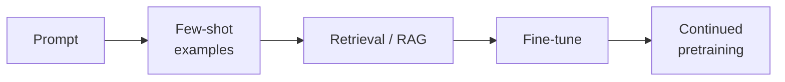

# Chapter 4 — Adapting the model

*Part II of the guide. Retrieval gave the model our knowledge. This chapter is
about changing the model's behaviour — and, crucially, knowing how far along the
adaptation spectrum you actually need to go.*

*Copilot status: factually grounded, but off-brand in tone, loose about our
required reply format, and running on a pricey general model for every ticket.*

---

## The spectrum, and the discipline of moving right slowly

There's a ladder of ways to make a model do what you want, from cheap and
reversible to expensive and committed:

Left = cheap, instant to change, no infrastructure. Right = more control, more
cost, more commitment, slower to iterate.

> **The one idea.** Move right only when everything to the left is genuinely
> exhausted. Most teams that "need to fine-tune" actually need a better prompt,
> better examples, or better retrieval — and fine-tuning would freeze a mistake
> into weights.

The reason this matters: each rung to the right trades away agility. A prompt
change ships in seconds; a fine-tune is a data-collection, training, evaluation,
and deployment project that you then have to *redo* every time the base model is
updated under you (Chapter 1).

## What fine-tuning is actually for

The most important distinction, and the one interviews probe: **fine-tuning
teaches _form_, not _facts_.** It's the right tool for:

- **Format and tone** — reliably emitting our house style, our JSON shape, our
  reply structure, without a giant prompt spelling it out every call.
- **A narrow skill done consistently** — a classification or extraction task where
  you have labelled data and want high reliability.
- **Cost and latency** — fine-tuning a small model to match a big one on *your*
  task, then serving the small one cheaply.
- **Tool-use reliability** — making an agent call your specific tools correctly.

It is the *wrong* tool for **fresh or changing knowledge** — that's RAG's job.
Facts baked into weights go stale and can't be access-controlled per user. If the
Copilot needs to know today's outage status, you retrieve it; you don't fine-tune
it in.

## LoRA and friends: why fine-tuning got cheap

You rarely retrain all the weights (full fine-tuning is expensive and needs a lot
of data). **Parameter-efficient fine-tuning (PEFT)** — most commonly **LoRA** —
trains small low-rank "adapter" matrices alongside the frozen base model. You
update a tiny fraction of parameters, so it's cheaper, faster, and needs less
data, and you can keep many task-specific adapters over one base model.
**QLoRA** adds quantization so it fits on modest GPUs.

Two neighbours you'll meet again in Chapter 13:

- **Distillation** — a large "teacher" model generates training data (or targets)
  to train a small "student," transferring much of the capability into something
  cheap to serve. This is often the real route to the Copilot's cost win.
- **Quantization** — shrinking a model's numeric precision (16-bit → 8/4-bit) so
  it uses less memory and runs faster, at a small accuracy cost. Adaptation for
  *serving*, not behaviour.

## You cannot fine-tune without evaluation

Fine-tuning is the point where "no eval set, no ship" (Chapter 10) stops being
advice and becomes survival. You need:

- **A clean dataset.** Quality and consistency beat volume; a few hundred correct,
  representative examples outperform thousands of noisy ones. Garbage in, frozen
  garbage out.
- **A held-out eval set** the model never trained on, scored the same way
  before and after, so you can prove the fine-tune helped and didn't regress
  other behaviour.
- **Versioning and rollback.** A fine-tuned model is a deployable artifact; pin
  it, version it, and be ready to roll back when the base model or requirements
  move.

This closes a loop you'll see everywhere in Part IV: production traces →
curated dataset → fine-tune (or better prompt) → eval → ship → more traces. The
**data flywheel** is the actual moat, not any single model.

> **Decision — prompt vs RAG vs fine-tune.** Need *knowledge*? RAG. Need
> *behaviour/format/tone* consistently? Consider fine-tuning — after you've
> proven a prompt and examples can't get there. Need *cheaper/faster* at fixed
> quality? Distill to a smaller fine-tuned model. Most production systems end up
> **RAG + a light fine-tune for form**, not one or the other.

## What breaks in production

- **Fine-tuning to add knowledge** → stale, unciteable, un-permissioned facts in
  weights. Use RAG.
- **Fine-tuning without a held-out eval** → you can't tell improvement from
  regression. Measure both.
- **Tiny or dirty datasets** → the model learns your noise. Curate ruthlessly.
- **Forgetting the base model moves** → your fine-tune is pinned to an old base;
  plan re-tunes and rollbacks.

## State of the Copilot

The model is now as good as a *single call* can be: it knows our facts (RAG),
speaks in our voice and format (a light fine-tune), and — via distillation — can
run cheaper. But it still only *talks*. A customer asking "cancel my subscription
and refund last month" needs the Copilot to *act*, safely, in our systems. That's
Part III: turning a good responder into an application with agency, starting with
the runtime that surrounds the model — the harness we've already built — and the
tools it can reach.

---

### Drill this
Cards for this chapter: [A10 · Model Adaptation](../a10-model-adaptation.md).
