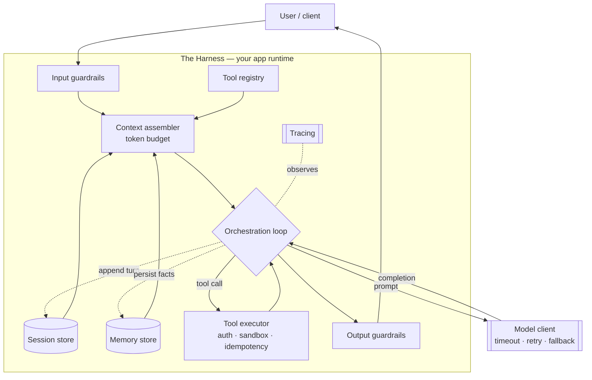
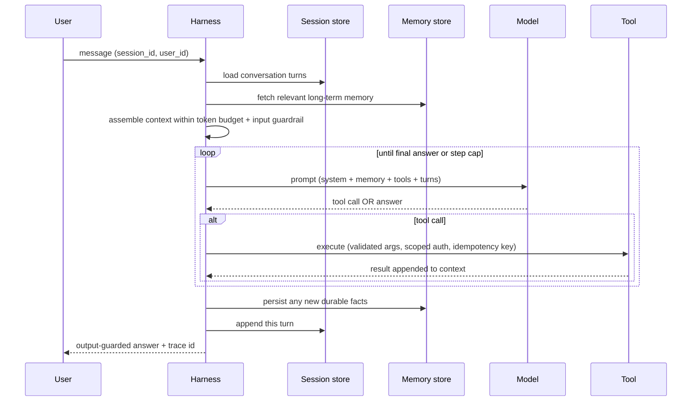
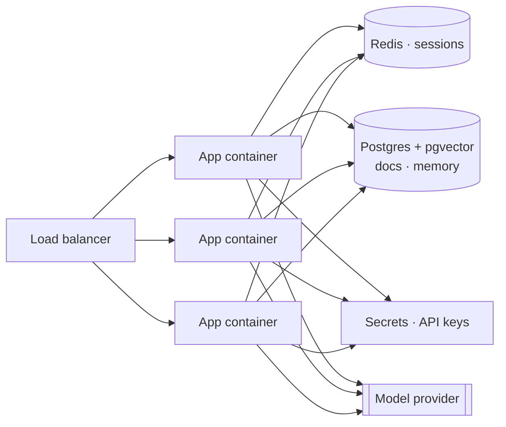

# Chapter 5 — The Harness: anatomy of an LLM app

*Part III of the guide. Earlier chapters made the model itself trustworthy
(what it is, how to prompt it, how to ground it). This chapter turns it into an
application; the ones after give that application agency and put it in
production.*

*Running example: the **Helpdesk Copilot**, a support assistant for a SaaS
product. By now it can answer questions grounded in our docs. Now it needs to
remember customers, take actions, and survive contact with production.*

---

## The moment the model stops being enough

Call the model API directly and you get a pure function: text in, text out, no
memory, no side effects, no idea who is asking. That is enough for a demo. It is
not an application. The instant a customer says *"actually, use the email from my
last ticket"* the illusion breaks — the model has no last ticket, no email, no
authority to look either up.

Everything that closes that gap — the code that remembers the conversation,
fetches what's relevant, calls the model, runs the tools it asks for, checks the
output, and logs the whole thing — is **the harness**. The model is the engine;
the harness is the car. This chapter is the car's blueprint, and it's the piece
most "how to prompt" material skips entirely.

> **The one idea.** An LLM app is a *stateless orchestration loop* wrapped around
> a *non-deterministic function*, backed by *external state*. Get those three
> nouns right and everything else is detail.

---

## The parts, and why each exists

**Model client.** The one place that talks to the provider, so timeouts,
retries with backoff, a fallback model, and a cost/token meter live in exactly
one wrapper — not scattered across your codebase. Treat the provider as what it
is: a rate-limited dependency that will occasionally 429, time out, or get
silently upgraded under you.

**Session.** The state of *this* conversation: its id, the ordered turns so far,
and any scratchpad the loop needs mid-task. It exists because the model is
stateless — every call must be handed the whole conversation, so someone has to
keep it between HTTP requests. Sessions are short-lived and usually expire.

**Memory.** What survives *across* sessions: the customer's plan tier, that they
prefer email, a summary of last week's incident, embeddings of past chats. It
exists because users expect the app to *know them* on Tuesday even though the
model forgot everything the instant Monday's request returned. Memory is durable
and lives in a real database.

**Tool registry.** The declared set of things the model may ask for — their
names, JSON schemas, and the code that runs them. It exists to enforce the most
important boundary in the whole system: **the model never executes anything; it
emits a request, and your executor decides whether to run it**, with your auth,
your timeout, your idempotency key. (Full chapter on this next.)

**Orchestration loop.** The heart. Assemble context → call model → is it a final
answer or a tool call? → if a tool, execute and append the result → loop, until
done or a step cap trips. This loop is the difference between a chatbot (one
pass) and an agent (many passes). The step cap is not optional — it's your
circuit breaker against a confused model burning tokens forever.

**Guardrails.** Cheap checks at the trust boundary: on the way in (block obvious
injection, PII, oversized input) and on the way out (validate the JSON schema,
scan for leaked secrets, confirm a citation exists). They exist because prompt
instructions are requests, not enforcement.

**Tracing.** A recorded span for every step — prompt, tokens, latency, tool
calls, cost — tied to a trace id you return to the user. It exists because an
LLM app has no stack trace; when it does something bizarre, the trace *is* your
debugger and your bill itemization.

---

## Session vs memory — the distinction people blur

These get used interchangeably and they are not the same thing. The clean split:

| | **Session** | **Memory** |
|---|---|---|
| Scope | one conversation | across all conversations |
| Lifetime | minutes to hours; expires | durable; you decide when to forget |
| Holds | turns, tool results, scratchpad | facts, preferences, summaries, embeddings |
| Store | Redis / a Postgres row | Postgres + a vector index |
| Mental model | *RAM for this chat* | *the app's long-term notebook* |

Two more splits sit *inside* memory. **Short-term memory** is the running
context of the current task — often just the session's recent turns, sometimes a
rolling summary when they overflow the budget. **Long-term memory** is what you
deliberately extract and persist ("this customer churned once, handle with
care") and later retrieve by relevance. The strategies for *what to keep, what
to summarize, and what to forget* are their own chapter
([Memory & State](../a06-memory-and-state.md)); here we only care that the
harness has two stores and knows which is which.

> **Decision — do you even need memory yet?** If your app answers one-shot
> questions, you need a session and no memory. Add long-term memory only when
> "remembering across visits" is a real requirement — it's a whole retrieval and
> privacy surface, not a free feature.

---

## How it all links: the life of one request

This is the wiring — the "how to link" you asked for — as a single request
flows through every part above.

Read it top to bottom and the whole app is just: **load state → assemble a
budgeted prompt → run the loop → persist state → answer**. Every box in the
component diagram is one arrow here. Nothing more mysterious than that.

The reason this shape matters: notice the harness itself holds **nothing**
between requests. Session and memory live in external stores; the loop is pure
orchestration. That is deliberate, and it's what makes the next section possible.

---

## Build and deploy it tomorrow

You do not need a framework or a GPU to ship this. Here is the smallest real
stack, and the deploy shape that lets it scale.

**The stack.**

- **API handler** (FastAPI, Express, whatever you know) — one stateless
  endpoint: `POST /chat`.
- **Model client** — the provider SDK behind your wrapper (timeout, 2–3 retries
  with jittered backoff, a cheaper fallback model, a token counter).
- **Session store** — Redis with a TTL, or a `sessions` table in Postgres. Key
  by `session_id`.
- **Memory + retrieval** — start with **one** Postgres using `pgvector`: your
  documents *and* long-term memory as embeddings in the same DB. Add a dedicated
  vector database only when volume forces it.
- **The loop** — ~150 lines you write yourself: assemble context, call model,
  branch on tool-call vs answer, cap steps. Skip the agent framework on day one;
  you'll understand your own failure modes far better.
- **Prompts + model version** — checked into the repo and **pinned**. A prompt
  and the model it was tuned against are one deployable unit; version them
  together.
- **Tracing** — structured logs at minimum (one line per step with tokens, cost,
  latency, tool name); a tool like Langfuse or OpenTelemetry when you can.
- **Guardrails** — an input check and strict output-schema validation. Two
  functions, not a platform.

**The deploy shape.**

Because the app servers are **stateless** (all state is in Redis/Postgres), you
just run several identical containers behind a load balancer and add more under
load — the exact horizontal-scaling story from the
[system-design track](../../concepts/00-index.md). Three things to get right that
are specific to LLM apps:

- **Autoscale on concurrency, not CPU.** Each request spends most of its life
  *waiting* on the model, using almost no CPU. Scale on in-flight requests or
  queue depth instead, or you'll never add capacity when you actually need it.
- **Put a queue and rate-limiter in front.** Provider TPM/RPM limits are a hard
  ceiling; user-facing requests should jump ahead of background jobs.
- **Ship prompt/model changes as canaries.** A one-word prompt edit can regress
  quality with no error and no exception. Roll it to a slice of traffic and
  watch your evals before going wide.

Secrets (API keys) go in a secrets manager, never the image. That's genuinely
enough to serve real users tomorrow.

> **Decision — framework or hand-rolled?** Reach for a framework when you need
> its *durable execution* or *multi-agent* machinery, not on day one. The loop is
> small; owning it buys you the debuggability you'll desperately want the first
> time the Copilot loops on itself at 2am.

---

## What breaks in production (and the fix)

- **State in process memory.** Keep the conversation in a local dict and it
  vanishes on the next deploy and is invisible to the other two containers. Fix:
  externalize *all* state — the reason the harness holds nothing.
- **Unbounded context.** Every turn re-sends the whole history; cost and latency
  climb until you hit the window. Fix: a token budget with a summarize-or-drop
  policy (Memory & State chapter).
- **No step cap.** A model that keeps calling tools will happily spend your
  month's budget in one request. Fix: hard cap, plus loop-detection.
- **Non-idempotent tool retries.** Retry a timed-out "issue refund" and you
  refund twice. Fix: idempotency keys on every side-effecting tool — a
  distributed-systems problem you already know how to solve.
- **Unpinned prompt + model.** The provider silently upgrades the model, your
  prompt was tuned to the old one, quality drifts, nothing errors. Fix: pin
  versions, monitor evals, alert on drift.

---

## State of the Copilot

We now have a real application, not a model call: it holds a conversation
(session), knows the customer across visits (memory), can act through validated
tools, checks itself at the edges (guardrails), records everything (tracing), and
runs as stateless containers you can scale and deploy. What it still lacks is
*judgment about its own quality* — right now we're trusting it. The next parts
give it **tools** (the request/execute boundary in full), a real **agent loop**,
and then the thing that makes all of it safe to change: **evaluation**.

---

### Drill this
The card deck for this area lives in
[Memory & State](../a06-memory-and-state.md),
[Tools & Integration](../a05-tools-and-integration.md), and
[Agent Architectures](../a04-agent-architectures.md). Read here to understand the
wiring; drill there to retain the details.
