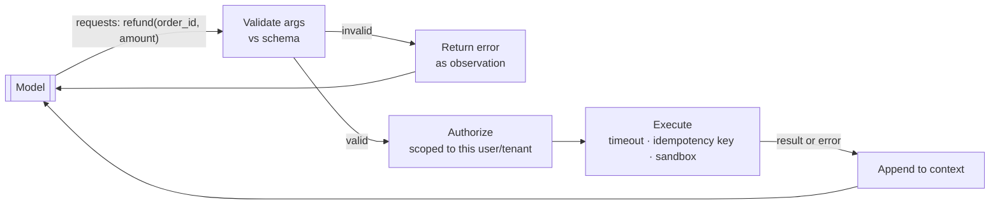

# Chapter 6 — Tools and integration

*Part III of the guide. The harness (Chapter 5) gave the model a registry of
tools. This chapter is about designing those tools and — above all — the boundary
where the model's request becomes real action in your systems.*

*Copilot status: a customer says "cancel my subscription and refund last month."
The Copilot needs to actually do that, not describe how.*

---

## The boundary that everything hinges on

Repeat after me, because it's the most misunderstood thing in the field: **the
model does not execute anything.** Given tool descriptions, it emits a structured
request — "call `refund(order_id=…, amount=…)`" — and stops. Your runtime
receives that request and *decides* whether to run it, with which credentials,
under what timeout, and what to do if it fails.

> **The one idea.** Tool calling splits *deciding* (the model's job) from *doing*
> (your code's job). Every permission, validation, sandbox, and idempotency
> control lives on your side of that line — never in the prompt.

## Designing tools the model can actually use

A tool is a name, a description, and a JSON schema for its arguments. The model
picks tools and fills arguments purely from those descriptions, so schema design
*is* the reliability work:

- **Describe intent, not implementation.** "Issue a refund for an order" beats
  "POST /v2/txn/reverse." The model reasons about purpose.
- **Keep arguments few and typed.** Enums over free strings, required over
  optional. Every optional field and union is another way for the model to guess
  wrong.
- **Mind the token budget.** Tool definitions sit in the context every call
  (Chapter 1). Fifty verbose tools can eat a big slice of the window and *lower*
  accuracy — the model gets worse at choosing as the menu grows. If you have too
  many, that's a signal to split responsibilities across agents (Chapter 9), not
  to cram.

Because the model can hallucinate a tool name or invent a parameter, **validate
every call against the schema before doing anything.** An invalid call isn't a
crash — it's an *observation* you hand back so the model can correct itself.

## Errors are data, not exceptions

When a tool fails — order not found, payment declined, timeout — don't throw and
kill the run, and don't leak a stack trace into the context. Return a structured,
model-readable result: `{"status": "error", "reason": "order_not_found"}`. The
whole point of the loop (Chapter 7) is that the model can *react* — apologize,
try a different order id, escalate. Errors surfaced as clean observations are what
make an agent robust instead of brittle.

## Idempotency: the refund-twice problem

Here's where your distributed-systems instincts earn their keep. The `refund`
tool times out. The harness retries. Did the first call go through? If refunds
aren't **idempotent**, you just paid the customer twice.

Every side-effecting tool needs an **idempotency key** — a stable id for "this
logical action" so a retry is a no-op if the first attempt already succeeded.
This is the same idempotency, retry, and backoff machinery from the
[system-design track](../../concepts/00-index.md); an agent that touches money or
external systems is a distributed transaction, and saying so out loud is worth
more than any framework name.

## Sandboxing and least privilege

The model is now, in effect, choosing what code runs on your behalf — sometimes
literally, if you give it a code-execution tool. So:

- **Scope credentials per call.** The `refund` tool acts as *this* customer on
  *this* order, not with an admin key that can refund anyone. Authorization
  happens in your executor, keyed to the request's user/tenant.
- **Sandbox dangerous tools.** Code execution runs in an isolated, resourced,
  network-restricted environment with a timeout — never in your app process.
- **Timeout everything.** A hung tool shouldn't hang the agent.

This is the groundwork for the security chapter (12): the danger isn't the model
"going rogue," it's the model being *tricked* into misusing tools it legitimately
has. Least privilege limits the blast radius.

## MCP: a standard for wiring tools to models

Historically every app hand-wired its own tool definitions to each provider's
format. The **Model Context Protocol (MCP)** standardizes it: an MCP *server*
exposes tools and resources over a common protocol, and any MCP-aware *client*
(an agent, an IDE, a chat app) can discover and call them. The value is
interoperability — build a "refunds" MCP server once and reuse it across agents
and vendors — but the trust boundary doesn't move: an MCP tool is still untrusted
input and scoped execution, now across a process boundary you must also secure.

## Testing the boundary

Tools are where an agent meets the real world, so test them like integration
points: **mock tools** to exercise the loop deterministically, assert that the
harness validates arguments and rejects malformed calls, and trace every tool
invocation (name, args, result, latency, cost — Chapter 11). You want the tool
layer boringly reliable, because the model above it never will be.

> **Decision — how many tools on one agent?** Keep it to a coherent handful the
> model can reason about. When the tool list or the context it requires bloats,
> or responsibilities split cleanly (billing vs technical vs account), that's the
> trigger to decompose into focused agents (Chapter 9) — not to add a 40th tool.

## What breaks in production

- **Executing unvalidated arguments** → hallucinated or malformed calls hit real
  systems. Validate against the schema first.
- **Non-idempotent side-effecting tools** → double refunds, duplicate tickets on
  retry. Idempotency keys everywhere.
- **Tool errors thrown as exceptions** → the run dies instead of recovering. Return
  errors as observations.
- **Over-broad tool credentials** → one injection turns a scoped helper into an
  admin. Scope per call, sandbox, timeout.

## State of the Copilot

It can act now — look up orders, cancel subscriptions, issue refunds — behind a
validating, authorizing, idempotent, sandboxed boundary. But we've been assuming
we know the sequence of tool calls. Real tickets don't work that way: "my invoice
is wrong and my integration is failing" needs the Copilot to *investigate* —
decide the next step from what it just learned. That's the leap from a scripted
tool-user to an agent, and the first question there is whether we should take it
at all.

---

### Drill this
Cards for this chapter:
[A5 · Tools, Function Calling & Integration](../a05-tools-and-integration.md).
