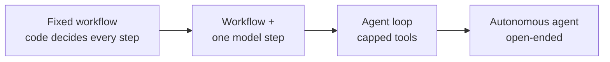
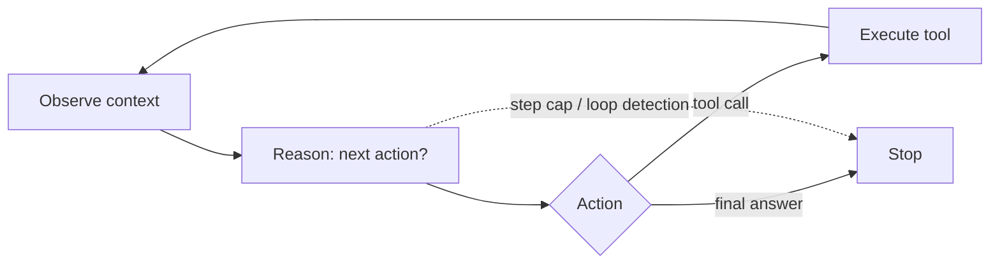

# Chapter 7 — Agent architectures

*Part III of the guide. Tools let the model act in a known sequence. An agent is
what you build when the sequence isn't knowable in advance — and the central
skill is deciding how much control to hand the model versus keep in code.*

*Copilot status: it can act, but only along paths we scripted. A ticket like "my
invoice is wrong and my integration is failing" needs investigation, not a script.*

---

## The one decision that matters most: workflow or agent

Every LLM feature sits somewhere on this axis:

Left: **workflows** — code defines the control flow and calls the model at
specific points. Predictable latency, deterministic tests, auditable, cheap.
Right: **agents** — the model decides what to do next. Flexible and adaptive, but
each step is an LLM round-trip, tests become hard, and failure modes are emergent
rather than designed.

> **The one idea.** Delegating control flow to the model is a *cost you justify*,
> not a default. Start with a workflow; upgrade a single step to an agent loop
> only when you can show the task genuinely needs dynamic, open-ended action
> selection.

The strongest thing you can say about most "agent" projects is **"this doesn't
need an agent."** Plenty of production "agents" are three prompts and a
conditional. Proposing a workflow with one model-driven step — and naming the
condition under which you'd upgrade it — reads as experience, not timidity. The
failure mode of an unnecessary agent isn't just cost; it's that you can't write a
meaningful test suite for emergent multi-step behaviour, so users find the bugs.

## The core loop

When you do need an agent, the irreducible primitive is a loop:

Observe → reason → act → observe, until the model says it's done or a cap trips.
That's it — the sophistication lives in the prompt, the tools (Chapter 6), and the
stopping logic. Note the cost shape from Chapter 1: every iteration re-sends the
whole accumulated context, so agent cost grows *faster than linearly* in steps.
Compaction (Chapter 2) and context isolation (Chapter 9) are the mitigations.

## Reasoning patterns, briefly

- **ReAct** — interleave an explicit "thought" before each action. Improves
  tool-use accuracy and gives you readable traces; costs tokens, and you usually
  log the thoughts rather than show them.
- **Plan-then-execute vs interleaved.** Generate a full plan upfront, or plan one
  step at a time. Upfront plans go stale (the model can't know what a tool returns
  until it calls it), so their main value is enabling a **human approval step**
  before execution. If you don't need sign-off, interleaved usually wins.
- **Reflection / self-critique** — have the model evaluate and revise its own
  output. The first pass catches most fixable errors; returns diminish fast, so
  cap it (often one pass). Cost scales linearly, quality logarithmically.

## Termination and stuck loops: the most under-designed part

Ask an engineer how their agent *stops* and you separate the experienced from the
hopeful. You need:

- **A step budget.** Non-negotiable. Start low (5–10 steps) and raise based on
  observed production distributions. Without it, a confused model burns tokens
  forever.
- **Stuck-loop detection.** Agents fall into degenerate repetition — calling the
  same tool with the same args, or ping-ponging between two. Detect and break it.
- **Clear success/failure conditions.** The agent must know what "done" looks
  like, and when to give up and escalate rather than flail.

## Humans in the loop

The question that most reshapes an agent's design is **what does being wrong
cost?** An agent that drafts a summary and one that issues refunds are different
systems — and the difference is approval gates, not prompting. Put a human in the
loop for **mutating actions** (before the refund executes), **high-cost or
irreversible decisions**, and **low-confidence outputs**. Confidence, note, comes
from structural signals (did it parse? did it cite? did a check pass?) not from
asking the model "are you sure?" — self-reported confidence is poorly calibrated.

## Composition, without going multi-agent yet

Before reaching for multiple agents, several single-brain patterns cover a lot:
**prompt chaining** (decompose a known multi-step task into a fixed sequence),
**routing** (classify the request, then dispatch to the right handler),
**parallelization** (fan out independent subtasks, or sample several times and
vote for reliability). These are workflow patterns — cheap and testable. Reach for
true multi-agent decomposition (Chapter 9) only when one agent's context and tools
genuinely can't hold the job.

> **Decision — workflow now, agent when?** Commit: "Fixed routing workflow today.
> I'd upgrade the investigation step to a capped agent loop when tickets need
> unbounded, non-enumerable tool sequences — and I'd roll back to the workflow if
> the agent's eval scores or cost regress."

## What breaks in production

- **Building an agent that didn't need to be one** → untestable, expensive,
  emergent failures. Prefer a workflow.
- **No step cap** → runaway loops and runaway bills. Cap hard; detect loops.
- **No termination/escalation condition** → the agent flails instead of handing
  off. Define done and give-up explicitly.
- **No approval gate on side effects** → the model's mistakes become real-world
  mistakes. Gate mutating actions.

## State of the Copilot

It's a real agent now: it investigates multi-part tickets, calls tools in an
order it decides, critiques its own drafts, stops sensibly, and asks a human
before touching money. But a single agent carrying billing *and* technical *and*
account knowledge is getting bloated and slower, and long investigations that
crash lose all their progress. The next two chapters fix those: how the agent
remembers and survives (memory & state), and when to split one overloaded brain
into several (multi-agent).

---

### Drill this
Cards for this chapter: [A4 · Agent Architectures](../a04-agent-architectures.md).
