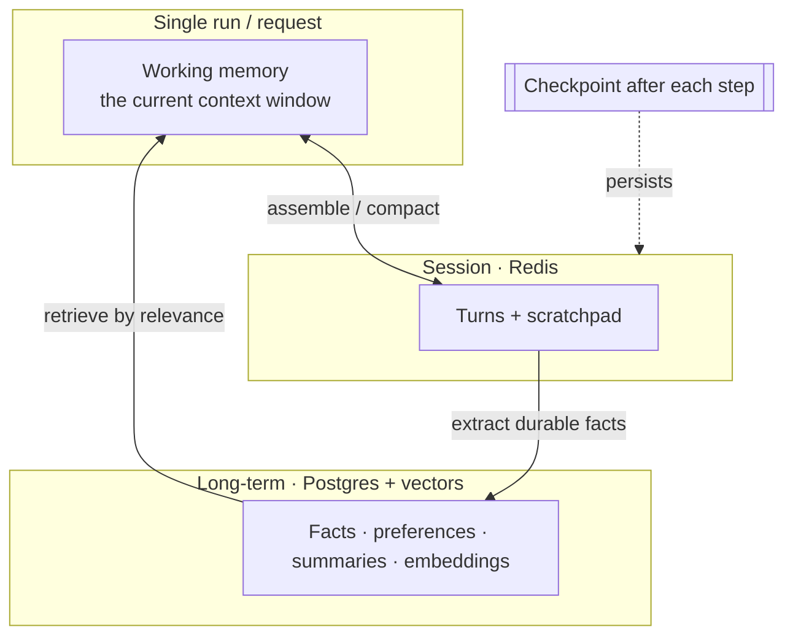

# Chapter 8 — Memory and state

*Part III of the guide. Chapter 5 gave the harness a session store and a memory
store. This chapter is the strategy layer: what to remember, what to forget, and
how a long-running agent survives a crash.*

*Copilot status: investigations now run many steps; conversations get long,
customers return next week expecting to be known, and yesterday a multi-step
refund run crashed halfway and lost everything.*

---

## Three tiers, one question: what deserves to persist?

Memory in an LLM app isn't one thing. It's tiers, each with a different lifetime
and a different job:

> **The one idea.** The model remembers nothing between calls; *your stores* are
> its memory. Every design choice here is really "what do I re-inject into the
> context, and when?" — because working memory is just the slice of all this that
> fits in the budget right now.

## Working memory: curate, don't accumulate

Working memory is the context window for the current run (Chapter 2). Left alone
it grows every step and every turn until it's expensive, slow, and lost in its own
middle. Managing it is the compaction problem from Chapter 2, applied
continuously: **keep recent and task-critical turns verbatim; summarize older
ones; drop the rest on a stated priority.** The Copilot's current investigation
steps stay sharp; last month's small talk becomes a one-line summary or nothing.

## Long-term memory: a deliberate write, a relevance-based read

Long-term memory is what survives across sessions — the customer churned once,
prefers email, runs the enterprise plan. Two operations, both worth designing:

- **Writing** is a *decision*, not a dump. You extract durable facts worth
  keeping ("customer is on legacy billing") rather than storing whole transcripts.
  Over-remembering is a cost and a privacy liability, not a feature.
- **Reading** is *retrieval* (Chapter 3) turned inward: fetch the memories
  relevant to the current turn by similarity, and inject only those into working
  memory. You don't reload a customer's entire history every message; you retrieve
  the pieces that matter now.

## Externalizing state, and why it's non-negotiable

From Chapter 5: the harness holds nothing between requests; all state lives in
external stores. This isn't tidiness — it's what lets you run many stateless
containers and scale horizontally (the [system-design track](../../concepts/00-index.md)
in one sentence). State in process memory vanishes on deploy and is invisible to
your other containers. Externalize or you can't scale.

## Durable execution: surviving the crash

Yesterday's half-finished refund is a durability problem, and it's the same one
distributed systems solved long ago. A long agent run is a sequence of steps with
side effects; if the process dies at step 6 of 10, you must not restart from
scratch (and re-issue side effects). The pattern is **checkpointing**: persist the
run's state after each step so it can **resume** from the last good checkpoint —
durable execution for agents. Frameworks (and workflow engines) exist specifically
for this; it's the main reason to reach for one (Chapter 7).

Its partner is the **saga / compensating action**: when a multi-step run fails
partway and can't simply resume, you *undo* the steps that did complete —
cancel the subscription change you already made before the refund failed. Any
agent that mutates external systems needs an answer to "how do we unwind a
partial run?"

## Scope and isolation: memory is a tenancy boundary

The instant memory is per-customer, it's a security surface. Tenant A's memories
must never surface in tenant B's context — a cross-tenant leak here is as serious
as one in retrieval (Chapter 3). So memory stores are **partitioned and filtered
by tenant/user at read time**, isolation is enforced in your code (not by asking
the model nicely), and per-user memory participates in data-deletion and privacy
requests. "Remember everything about everyone in one pile" is a breach waiting to
happen.

> **Decision — how much to remember?** Personalization pulls toward remembering
> more; cost, privacy, and staleness pull toward less. Default to remembering
> little and explicitly — durable facts with clear value — and let evals show
> whether more memory actually improves outcomes before you store more.

## What breaks in production

- **State in process memory** → lost on deploy, invisible across containers.
  Externalize everything.
- **Unbounded memory/context growth** → cost and latency creep, then overflow.
  Compact working memory; write long-term memory selectively.
- **No checkpointing on long runs** → a crash loses all progress and may re-fire
  side effects. Checkpoint and resume; compensate partial runs.
- **Shared/leaky memory across tenants** → privacy breach. Partition and filter by
  tenant at read time.

## State of the Copilot

The Copilot now holds a conversation, knows returning customers, curates its
working context, survives crashes via checkpoints, unwinds partial actions, and
keeps every tenant's memory walled off. It's a competent single agent — arguably
*too* single: it's juggling billing, technical, and account expertise in one
bloated context and one giant tool list. The next chapter asks whether to split
that brain, and warns why you usually shouldn't rush to.

---

### Drill this
Cards for this chapter: [A6 · Memory & State](../a06-memory-and-state.md).
