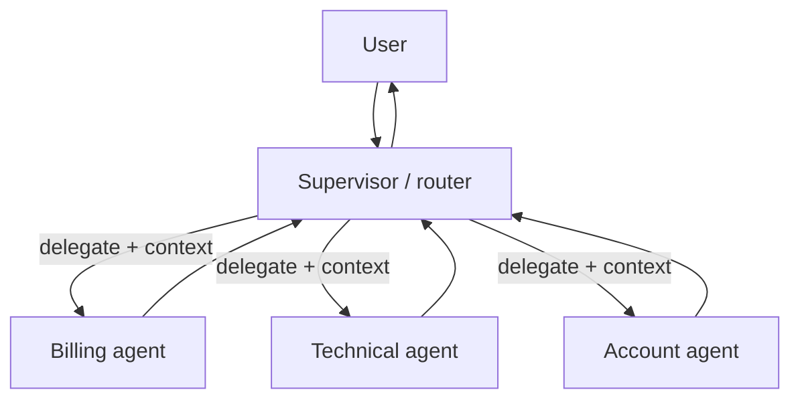

# Chapter 9 — Multi-agent systems

*Part III of the guide. The final step in giving the Copilot agency: splitting one
overloaded agent into several — and a hard look at when that's a mistake.*

*Copilot status: one agent now carries billing, technical, and account knowledge.
Its context is bloated, its tool list is long, and it's getting slower and less
accurate as it juggles everything.*

---

## Decompose reluctantly

Multiple cooperating agents sound sophisticated, and that's the trap. Every agent
you add multiplies cost and latency and introduces coordination failures a single
agent never has.

> **The one idea.** Multi-agent is a response to a *specific* problem — one
> agent's context or tools won't fit the job, or subtasks are genuinely
> independent — not an architecture to aspire to. Default to one agent; split when
> forced.

Good triggers to decompose: the tool list or context has grown past what one model
handles well (our Copilot's situation); responsibilities separate cleanly and
benefit from **context isolation** (a specialist with a focused prompt and few
tools outperforms a generalist drowning in options); or subtasks are truly
parallel. Bad triggers: "it feels more modular," or copying a framework's demo.

## Topologies

The common shapes, in rough order of how often they're the right call:

- **Single agent** — still the default. Exhaust it first.
- **Orchestrator–worker / supervisor (hierarchical).** A coordinator decomposes
  the task and delegates to focused workers, each with its own isolated context.
  This fits the Copilot: a supervisor routes to billing/technical/account
  specialists and assembles the result. Clear control, easy to trace.
- **Agent-as-tool.** Wrap a whole agent behind a tool interface so another agent
  can call it without knowing its internals — the same request/execute boundary
  from Chapter 6, one level up.
- **Handoff / network.** Peers transfer control and context to each other. Most
  flexible, hardest to keep predictable; use sparingly.

## Interactions: it's all about context transfer

When one agent hands off to another, the real design question is **what context
travels with the handoff.** Send too little and the worker lacks what it needs;
send everything and you've lost the isolation that made decomposition worth it
(and you pay to re-process it). Prefer passing a focused brief — the sub-goal and
just the relevant facts — not the whole transcript. Decide deliberately between
**shared context** (agents see a common scratchpad — simple, but couples them and
risks contamination) and **isolated context** (clean, but you must choose what to
pass).

## Failure and cost: the multiplication problem

Here's the bill nobody forecasts. Recall from Chapter 1 that every agent step
re-sends its full context. Now you have several agents, each looping, each
re-sending — cost and latency **multiply**, they don't add. A three-agent system
where each runs a five-step loop isn't 15 calls' worth of context; it's far more,
because contexts accumulate within each loop.

Beyond cost, multi-agent adds failure modes single agents lack: **error
propagation** (a worker's subtly wrong output poisons the supervisor's
conclusion), **coordination overhead** (agents waiting on each other), and
**emergent behaviour** you didn't design and can't easily reproduce. Debugging
shifts from "read the trace" to "reconstruct a conversation between several
non-deterministic processes."

## Operating a multi-agent system

Two things become mandatory the moment you have more than one agent:

- **Distributed tracing across agents.** A single trace must span the supervisor
  and every worker, so you can follow one user request through the whole
  constellation. Without it, debugging is hopeless (Chapter 11).
- **Trajectory evaluation.** You now grade not just final answers but the *path* —
  did the supervisor route correctly, did handoffs carry the right context, did a
  worker loop? That's the bridge to evaluation (Chapter 10), which is what makes
  any of this safe to change.

> **Decision — single or multi-agent?** Bias hard to single. Commit: "One agent
> with routing today. I'd split into supervisor + specialists when the single
> agent's tool list and context measurably hurt accuracy — and I'd collapse back
> if the coordination cost outweighs the isolation benefit." Naming the reversal
> is the senior move.

## What breaks in production

- **Premature multi-agent** → multiplied cost/latency and emergent bugs for no
  real gain. Prove one agent can't do it first.
- **Handing off the entire transcript** → you pay to re-process context and lose
  isolation. Pass a focused brief.
- **Shared mutable context** → agents contaminate each other. Prefer isolation;
  share deliberately.
- **No cross-agent trace** → debugging a constellation blind. One trace must span
  all agents.

## State of the Copilot

The Copilot is now a supervisor over focused specialists, each with a clean
context and a short tool list, traced end to end. Functionally, it's everything we
set out to build: it understands, grounds, remembers, acts, and coordinates. But
we've been *assuming* every change we made helped. We have no proof. Nothing yet
stops a well-meaning prompt tweak from silently wrecking quality. Part IV starts
where seniority actually shows — measuring whether any of this works.

---

### Drill this
Cards for this chapter: [A12 · Multi-Agent Systems](../a12-multi-agent-systems.md).
