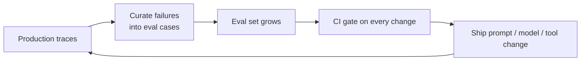

# Chapter 10 — Evaluation

*Part IV of the guide. Everything so far assumed our changes helped. This chapter
is how you actually know — and why, for LLM systems, evaluation isn't a phase but
the practice that makes iteration safe.*

*Copilot status: it works, we think. We have no way to prove a change improved it
or quietly broke it.*

---

## Why LLM systems have no tests by default

A normal function has unit tests: fixed input, asserted output. An LLM system
can't be tested that way — from Chapter 1, the same input can yield different
output, so snapshot assertions are flaky by construction, and "correct" is a
fuzzy, semantic target, not string equality.

> **The one idea.** The eval set plus a CI gate is the engineering practice that
> replaces unit tests for LLM systems. **No eval set, no ship.** Without it, every
> change is a guess and every regression is discovered by users.

## The eval set: your source of truth

An eval set is a curated collection of representative inputs paired with success
criteria (not exact answers). The best ones come from **real traffic**: mine
production for the queries you care about and the ones you got wrong, and turn
each into a case. It's a living asset — every production failure becomes a new
eval case so the same bug can never regress twice. That growth *is* the moat.

## Measure the right thing, per component

Recall the recurring theme: measure components separately or you'll tune the wrong
one.

- **Retrieval** (Chapter 3): recall@k, MRR — did the right chunk get found?
- **Generation**: groundedness (did the answer stick to sources?), correctness,
  format compliance, tone.
- **Agents** (Chapters 7, 9): **trajectory evaluation** — grade the *path*, not
  just the final answer. Did it pick the right tools, in a sane order, without
  looping, with the right handoffs?

Prefer semantic and structural checks over exact match: did it parse, did it
cite, did the enum value make sense, did the claim match the source.

## How you actually score

- **Programmatic checks** — cheapest and most reliable where they apply: schema
  validation, "does a citation exist," "did the tool succeed," regex/range checks.
  Use these first.
- **LLM-as-judge** — a model grades outputs against a rubric. Scales far better
  than human review, but it's a model, so it inherits model problems: it's biased
  (toward verbosity, toward its own style), poorly calibrated, and gameable. Make
  it usable by giving it a **structured rubric**, and — critically — **validate
  the judge against human labels** before you trust it. An unvalidated judge is
  just a confident guess about a confident guess.
- **Human evaluation** — the ground truth you calibrate everything else against.
  Expensive, so spend it on a sampled, high-value slice and on validating your
  judges.

## Eval as infrastructure: the gate

The payoff is turning all this into a **CI gate**. Prompt, model, tool, and
retrieval changes run against the eval set automatically, and a regression blocks
the deploy — exactly the regression testing from Chapter 2, made real. Keep a
stable regression set (things that must never break) alongside a growing frontier
set (new capabilities). This is what lets a team change an LLM system *fast without
fear*.

## The flywheel

Put it together and evaluation stops being a checkpoint and becomes a loop that
compounds:

Production reveals failures → failures become eval cases → the gate stops them
recurring → you ship faster → production reveals subtler failures. The same
flywheel feeds the fine-tuning dataset from Chapter 4. Teams that build this
outrun teams that don't, regardless of which model they use.

## Evaluation doesn't stop at deploy

Offline evals never capture everything, so pair them with **online evaluation**:
guardrail metrics (refusal rate, groundedness on live traffic), sampled traces
reviewed by humans, and A/B tests (Chapter 2) that compare variants on real
business outcomes. And because the model can change under you (Chapter 1),
continuous eval is your early warning for **silent quality drift** with no deploy
of your own.

> **Decision — what do you gate on?** Gate on the regressions you can't tolerate
> (correctness, groundedness, format, safety refusals), measured with the cheapest
> reliable method available (programmatic > validated judge > human). Don't gate
> on noisy metrics you can't act on.

## What breaks in production

- **Shipping without an eval set** → regressions land on users. Build one before
  you iterate.
- **Snapshot/exact-match tests** → perpetually flaky on non-deterministic output.
  Assert semantics and structure.
- **Trusting an unvalidated LLM judge** → confident, biased scores. Calibrate it
  against humans.
- **A static eval set** → it goes stale as traffic shifts. Grow it from production
  failures.

## State of the Copilot

We can now change the Copilot with confidence: every edit is gated, every
production failure becomes a permanent test, and we'd catch the model drifting
under us. What we haven't faced is *scale and adversity* — launch traffic, provider
429s, latency spikes, a runaway bill, a 2am page. The next chapter is the
operational machinery that keeps the system up, observable, and affordable when
real users arrive.

---

### Drill this
Cards for this chapter:
[A7 · Evaluation & Experimentation](../a07-evaluation-and-experimentation.md).
