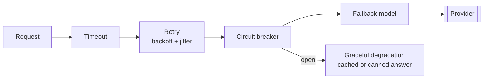

# Chapter 11 — Reliability, observability, and cost

*Part IV of the guide. Evaluation told us the Copilot is good. This chapter keeps
it good when real traffic, a flaky provider, and a finance team all arrive at
once.*

*Copilot status: launch day. We're seeing provider 429s, latency spikes under
load, a bill climbing faster than expected, and our first 2am incident.*

---

## The model is a dependency — engineer it like one

Every reliability pattern here is one you already know from distributed systems,
pointed at the model provider. That's the whole mindset: the provider will time
out, throttle, and occasionally fall over, so wrap it the way you'd wrap any
unreliable dependency.

- **Timeouts** on every model and tool call — a hung provider must not hang your
  request.
- **Retries with exponential backoff and jitter.** The jitter matters: without it,
  a 429 triggers synchronized retries that hammer the provider in waves — a retry
  storm that makes the outage worse.
- **Circuit breakers** so that when the provider is clearly down, you stop sending
  (and stop paying for timeouts) and fail fast.
- **Fallback models.** When the primary is throttled or down, degrade to a
  secondary provider or a smaller model. A worse answer beats no answer.
- **Rate-limit handling as architecture.** TPM/RPM are hard ceilings (Chapter 1),
  so put a **queue** in front and give user-facing requests a **priority lane**
  ahead of background jobs. Backpressure, not blind retry.

## Caching: the cheapest reliability and cost win

Caching cuts latency, cost, *and* load on a rate-limited dependency at once:

- **Prompt/prefix caching** (Chapter 1) — reuse the KV cache for a stable
  system-prompt-and-tools prefix. Free-ish TTFT, discounted tokens.
- **Semantic caching** — serve a stored answer when a new query is *semantically*
  close to a past one. Powerful, but bounded by non-determinism and staleness:
  set similarity thresholds carefully and a TTL, or you'll serve confidently wrong
  cached answers.
- **Retrieval caching** — cache embeddings and hot retrieval results.

As always, the hard part is **invalidation**: when docs change or the model
updates, stale caches lie. Tie cache keys to content and model versions.

## Cost control: make spend a first-class metric

The scary bill is a design gap, not bad luck. The levers, from Chapter 1, applied
operationally:

- **Cut output tokens** (the dominant driver), **route by difficulty** (cheap
  model first, escalate rarely), **cache** aggressively.
- **Budgets and caps.** Per-request and per-user token/cost ceilings, and a step
  cap on agents (Chapter 7) so one runaway loop can't spend the month.
- **Monitor and alert on spend** like you would on error rate. A cost spike is an
  incident — often a retry storm, a prompt-size regression, or an agent looping.

## Observability: traces are your only debugger

An LLM app has no stack trace. When it does something bizarre, the **trace** is
your debugger and your itemized bill. Instrument every step with a span: prompt,
token counts, latency, cost, tool calls and results, and a **trace id** returned
to the user. Spans must stitch into one trace across an agent's loop and across
multiple agents (Chapter 9). Structured logs at minimum; a purpose-built tool
(Langfuse, LangSmith, OpenTelemetry-based) when you can.

The three question classes your observability must answer: *is it up?* (latency,
error rate, saturation), *is it good?* (quality/guardrail metrics, drift), and
*what did this specific weird request do?* (the full trace).

## Incidents specific to LLM systems

Your on-call runbook needs entries a normal service doesn't:

- **Provider outage / throttling** → circuit break, fail over to fallback, drain
  the queue by priority.
- **Silent quality regression** → the model changed under you (Chapter 1) or a
  prompt shipped without eval. Your continuous evals (Chapter 10) should page you;
  roll back the prompt/model version.
- **Cost spike** → find the loop or size regression in traces; enforce caps.
- **Injection / abuse** → covered next chapter, but it's an incident class: detect,
  contain blast radius, revoke the tool path.

> **Decision — build vs buy observability?** Buy (or adopt open standards) unless
> you have a strong reason to build. The differentiator is *what* you instrument
> and *which* quality metrics you track, not the plumbing.

## What breaks in production

- **Retries without jitter** → synchronized retry storms amplify outages. Backoff
  *and* jitter, plus circuit breakers.
- **No cost caps or spend alerts** → a looping agent or size regression bills you
  a fortune silently. Cap and alert.
- **No drift detection** → a provider model update degrades quality with no error.
  Continuous eval as an alarm.
- **No end-to-end trace** → unexplainable behaviour you can't debug. One trace id
  per request, spanning every step and agent.

## State of the Copilot

It now survives launch: throttling and outages degrade gracefully, caches absorb
load, spend is capped and alarmed, and every request is traceable end to end. But
we've added something dangerous without fully securing it — the Copilot reads
*untrusted* text (customer messages, retrieved content) and can *act* (refunds,
account changes). That combination is the core security problem of agentic
systems, and it's next.

---

### Drill this
Cards for this chapter:
[A8 · Production Reliability, Observability & Cost](../a08-production-reliability.md).
