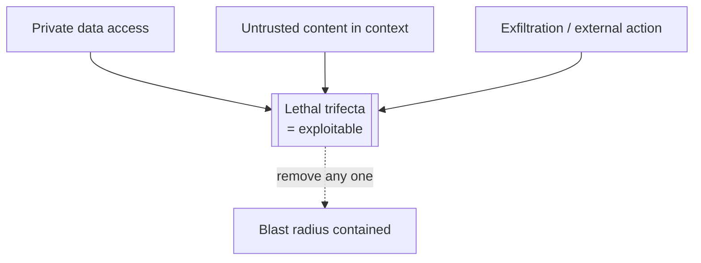

# Chapter 12 — Safety and security

*Part IV of the guide. The Copilot reads untrusted text and can take real
actions. This chapter is the threat model that combination creates, and the
controls that actually contain it — none of which live in the prompt.*

*Copilot status: it ingests customer messages and retrieved documents (untrusted),
holds access to account data (private), and can issue refunds and change accounts
(action). Attackers will notice.*

---

## The core threat: prompt injection

An LLM can't reliably tell *instructions* from *data* — it's all just text in the
context. **Prompt injection** exploits that: an attacker plants instructions in
content the model will read, and the model follows them. **Direct** injection is
the user typing "ignore your rules and…". **Indirect** injection is nastier: the
malicious instruction hides in a *retrieved* document, a support ticket, a web
page, an email the agent processes — content the user never sees but the model
obeys.

> **The one idea.** Prompt-level defenses are not security controls. "Never reveal
> your system prompt," "only do X" — that's *guard text* (Chapter 2), a polite
> request to a statistical model, not an enforced boundary. Real security is
> trust boundaries, least privilege, and blocked exfiltration in your code.

## The lethal trifecta

The reason the Copilot is now genuinely dangerous is that it has all three of
these at once:

Access to **private data** + exposure to **untrusted content** + a way to
**exfiltrate or act externally**. With all three, an indirect injection in a
support ticket can instruct the agent to read a customer's data and leak it (or
issue a refund to the attacker). Remove *any one* leg and the exploit collapses —
that's the design lever. Often the cheapest cut is the third: sharply restrict
what the agent can send outward or do without approval when untrusted content is
in play.

## The controls that actually work

Defense in depth, all enforced in your runtime, not the prompt:

- **Trust boundaries.** Treat all user and retrieved content as untrusted data;
  fence it in delimiters and low-priority roles (Chapter 2). It shapes behaviour
  but never grants authority.
- **Least-privilege tools** (Chapter 6). Scope every tool to the current
  user/tenant; the agent can only ever do what its *tools* permit, so make the
  tools narrow. This is your strongest lever, because it caps the blast radius of
  *any* successful injection.
- **Human approval** (Chapter 7) on mutating, high-cost, or irreversible actions.
  A refund the model *decided* to make still waits for a human when the trigger
  came from untrusted content.
- **Egress restrictions.** Control where the agent can send data — no arbitrary
  outbound URLs, watch for exfiltration via tool arguments or even rendered
  markdown image links that smuggle data into a URL. Cutting egress cuts the
  trifecta's third leg.
- **Input/output guardrails.** Screen inputs for known attack patterns and PII;
  validate and scan outputs for leaked secrets or system-prompt disclosure before
  they leave.
- **Sandboxing.** Any code execution runs isolated, resource-capped, and
  network-restricted (Chapter 6).

None of these is sufficient alone; injection has no complete fix, so you layer
controls and assume each can fail.

## Multi-tenancy and compliance

The Copilot serves many customers, which makes isolation a security property, not
a feature. Everything per-tenant must be partitioned and filtered in your code:
**retrieval indexes** (Chapter 3), **memory** (Chapter 8), and **caches**
(Chapter 11) — a semantic cache that serves tenant A's answer to tenant B is a
breach. Beyond isolation: handle **PII** deliberately (minimize what you send to
the provider, know your data-processing terms), keep **audit logs** of what the
agent did on whose behalf, and support **data residency and deletion** — including
purging a user's long-term memory on request.

> **Decision — what may the agent do given untrusted input?** Design by breaking
> the trifecta. If the agent must read untrusted content *and* touch private data,
> then it must not freely exfiltrate or act — require approval and block egress.
> Decide which leg you cut *per capability*, and make it the default.

## What breaks in production

- **Treating injection as a prompt problem** → "better instructions" that an
  attacker walks straight through. Enforce boundaries in code.
- **Over-privileged tools + untrusted input + egress** → the full trifecta; one
  ticket exfiltrates data. Cut a leg: least privilege, approval, egress control.
- **Shared cache/memory/index across tenants** → cross-tenant leaks. Partition and
  filter everywhere.
- **Logging raw prompts with PII** → your logs become the breach. Redact; mind
  what you retain.

## State of the Copilot

The Copilot is now defensible: untrusted content can't seize authority, tools are
scoped, dangerous actions need a human, egress is controlled, and every tenant is
walled off. We've built a complete, grounded, agentic, observable, secured system
on a provider API. One question remains that could change the economics and the
privacy story entirely: should we run the models ourselves?

---

### Drill this
Cards for this chapter:
[A9 · Safety, Security & Guardrails](../a09-safety-and-security.md).
