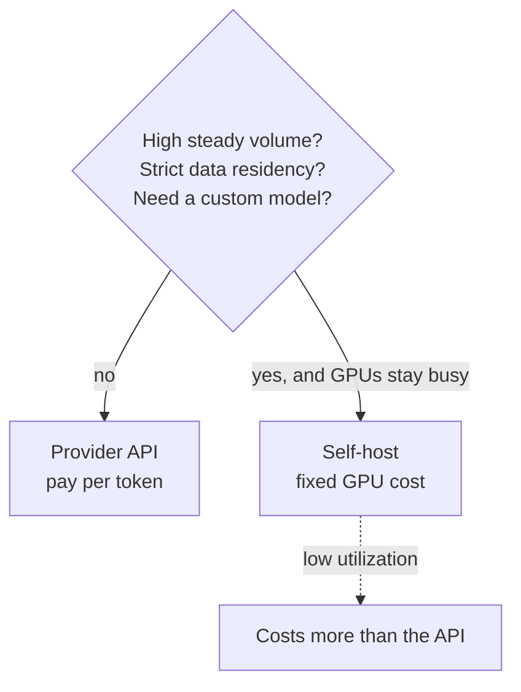

# Chapter 13 — Inference infrastructure

*Part IV of the guide. So far the model has been someone else's API. This chapter
is what changes when you consider running it yourself — the economics, the
constraints, and why "self-host to save money" is usually wrong.*

*Copilot status: volume is growing and legal wants customer data to stop leaving
our tenancy. Both push toward self-hosting. Should we?*

---

## Build vs buy: default to buy

A provider API gives you a frontier model with zero serving ops, pay-per-token
elasticity, and instant scale — at the cost of per-token pricing and your data
leaving your boundary. Self-hosting gives you control, data residency, fixed
capacity cost, and the freedom to run custom or fine-tuned models — at the cost of
a serious GPU-operations burden.

> **The one idea.** Self-hosting only wins at **high, steady utilization**. GPUs
> cost the same whether busy or idle, so the economics live or die on keeping them
> full. Below that line, the API is cheaper *and* less work.

Good reasons to self-host: strict privacy/residency, a genuinely custom or
fine-tuned model, predictable high volume, or latency needs an external hop can't
meet. "It'll be cheaper" is only true if you'll actually saturate the hardware.

## What actually limits you: GPU memory

From Chapter 1, GPU memory holds two things during serving: the **model weights**
(fixed) and the **KV cache** (grows with context length × concurrent requests).
That second term is the ceiling on how many users you can serve at once — not
compute. This is why long contexts are expensive at the infrastructure level:
every extra token of context is KV-cache memory taken from concurrency.

## Serving: getting throughput without wrecking latency

Naive one-request-at-a-time serving wastes the GPU. The techniques that matter:

- **Continuous (in-flight) batching** — new requests join the batch as others
  finish, instead of waiting for the slowest. The single biggest utilization win;
  it's the default in modern servers (vLLM, TGI, TensorRT-LLM).
- **Paged attention** — manage KV-cache memory in pages (like virtual memory) to
  cut fragmentation and fit more concurrent requests.
- **Quantization** (Chapter 4) — serve at 8- or 4-bit to shrink the memory
  footprint and speed decode, trading a little accuracy for a lot of capacity.
- **Prefix caching** — reuse the KV cache for shared prompt prefixes across
  requests.

The constant tension is **throughput vs latency**: bigger batches raise tokens/sec
across all users but add per-request latency (especially inter-token). You tune the
batch to your SLO (Chapter 1), not to a benchmark.

## Scaling, scheduling, and the cost model

GPUs don't autoscale like stateless web servers. They're scarce, expensive, and
slow to warm — **cold starts** can be minutes as multi-GB weights load. So you
provision for the peak you can predict, absorb bursts with a **queue** (Chapter
11), and keep headroom rather than scaling reactively. Advanced setups
**disaggregate** prefill and decode onto different hardware because they stress
different resources (compute vs memory bandwidth).

The cost model is simply: `GPU-hours × price ÷ tokens served`. The denominator is
everything. At 80% utilization self-hosting can beat the API; at 15% it's far
worse *and* you carry the ops. Always compute the breakeven against real,
honest utilization — not hoped-for volume.

## Supporting infrastructure

Around the serving engine you'll want a **model gateway** (one endpoint that
routes across models, providers, and replicas, with fallback and rate-limiting —
Chapter 11), a **model registry** for versioning weights and adapters (Chapter 4),
and load balancing across replicas. A gateway is valuable even if you *never*
self-host: it's where routing, fallback, caching, and cost controls live for your
provider calls too.

> **Decision — when to self-host?** When residency or a custom model *requires*
> it, or when steady volume clears the utilization breakeven with margin. Otherwise
> buy, and revisit when a trace-backed forecast shows GPUs would stay busy. Many
> mature systems land on a **hybrid**: API for burst and frontier tasks, a
> self-hosted small/fine-tuned model for the high-volume, privacy-sensitive core.

## What breaks in production

- **Self-hosting at low utilization** → more cost and more ops than the API you
  left. Check the breakeven honestly.
- **Sizing by request count, not KV memory** → you OOM under concurrency (Chapter
  1). Size for weights + peak KV cache.
- **Reactive GPU autoscaling** → cold starts miss the spike entirely. Provision for
  peak; queue the overflow.
- **No gateway** → routing, fallback, and cost control scattered everywhere.
  Centralize, even for API-only.

## State of the Copilot

We now know the honest answer: keep the frontier model on the API for burst and
hard tasks, and self-host a small fine-tuned model for the high-volume,
privacy-sensitive core — behind a gateway that already gives us routing, fallback,
and cost control. Every piece of the system is built and understood. What's left
is judgment: how to assemble these pieces for a *new* problem from scratch, and how
to actually take it from repo to production. That's Part V.

---

### Drill this
Cards for this chapter:
[A11 · Inference Infrastructure](../a11-inference-infrastructure.md).
