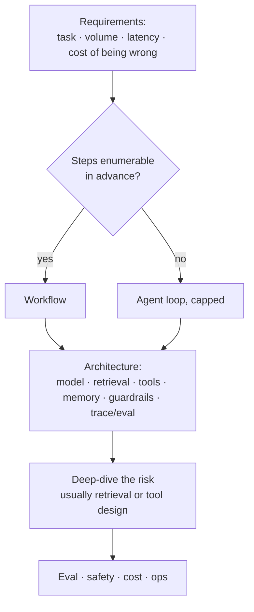

# Chapter 14 — Reference designs and judgment

*Part V of the guide. We built one system end to end. This chapter generalizes:
how to approach a _new_ LLM problem from scratch, and the reference shapes most
systems reduce to.*

*Copilot status: complete. Now we step back and turn the experience into
transferable judgment.*

---

## You're an engineer, not a magician

The reframe that underpins everything: you're building on a dependency that's
non-deterministic, expensive, rate-limited, sometimes down, and periodically
swapped under you. Almost every strong decision follows from taking that
seriously. The interviewer — or the on-call rotation — is testing whether you
treat the model as a component to be engineered around, not a wish to be phrased
well.

## How to approach any LLM problem

A repeatable order that keeps you out of trouble:

1. **Requirements first.** Task, users, volume, latency expectation, budget — and
   the question that reshapes everything: **what does being wrong cost?** A drafting
   assistant and a refund agent are different systems, and the difference is
   approval gates and permissions, not prompting.
2. **Workflow or agent?** (Chapter 7.) Decide out loud, and bias to the workflow.
3. **Architecture.** Client → orchestration → model, plus retrieval, tools,
   memory, guardrails, and the trace/eval pipeline. Draw the loop and how it
   terminates.
4. **Deep-dive where the risk concentrates** — usually retrieval quality or tool
   design.
5. **Reserve time for eval, safety, cost, ops.** This is where seniority shows;
   don't let it get squeezed.

> **The one idea.** Commit to a choice, then name its **trigger** and its
> **reversal**: "Fixed workflow now; upgrade this step to a capped agent when
> tasks become non-enumerable; roll back if eval scores or cost regress." That
> single habit reads as experience more than any framework name.

## Reference designs

Most systems are a variation of one of these.

**1. Grounded Q&A (RAG assistant).** A docs/support bot that *informs*. Mostly a
workflow: retrieve → assemble → generate → cite. The risk is entirely in
retrieval (Chapter 3) and per-user permissions; there are no dangerous side
effects, so evaluation centers on groundedness and recall@k. Cheapest, safest
starting point — and often all a problem needs.

**2. Action agent (our Copilot).** *Informs and acts.* A capped agent loop over
scoped, idempotent, sandboxed tools (Chapter 6), with human approval on mutating
actions (Chapter 7) and the lethal trifecta explicitly broken (Chapter 12). The
risk moves to the tool boundary and security. Evaluation adds trajectory grading.

**3. Multi-agent / orchestrator.** *Coordinates specialists.* A supervisor over
focused workers (Chapter 9), justified only when one agent's context and tools
won't fit. The risk is multiplied cost/latency and emergent behaviour; you need
cross-agent tracing and trajectory eval before you build it.

**4. Batch pipeline (the honest workflow).** Offline classification, extraction, or
enrichment over many records. No agent at all — deterministic steps calling the
model, optimized for throughput (Chapter 13) over latency. The reminder that most
"AI features" are pipelines.

## Estimate like an engineer

Be ready to put numbers on it. **Cost per task** = tokens × price across the calls
a task makes — and name the dominant driver (usually output tokens, or an agent's
step count re-sending context, Chapter 1). **Latency budget** = TTFT + output ×
ITL, plus retrieval and tool time; decide where streaming hides it. **Capacity** =
KV-cache memory per request against concurrency (Chapter 1/13). An answer with a
rough cost and latency model beats a vaguer, grander one.

## The failure modes to name unprompted

Strong engineers enumerate what will break: **runaway agent loops** (step cap),
**context overflow / lost-in-the-middle** (budget + compaction), **bad tool
arguments** (validate at the boundary), **prompt injection** (break the trifecta),
**silent model drift** (continuous eval), **cost spikes** (caps + alerts), and
**cross-tenant leaks** (isolation everywhere). Naming the failure *and* its control
is the whole game.

## State of the Copilot

We can now design any of these from a blank page and defend every choice with a
trigger and a reversal. One thing remains between "designed" and "real": actually
shipping it — the concrete, ordered path from repo to production. That's the
finale.

---

### Drill this
Cards for this chapter:
[A13 · The Agentic AI Interview Playbook](../a13-agentic-interview-playbook.md).
