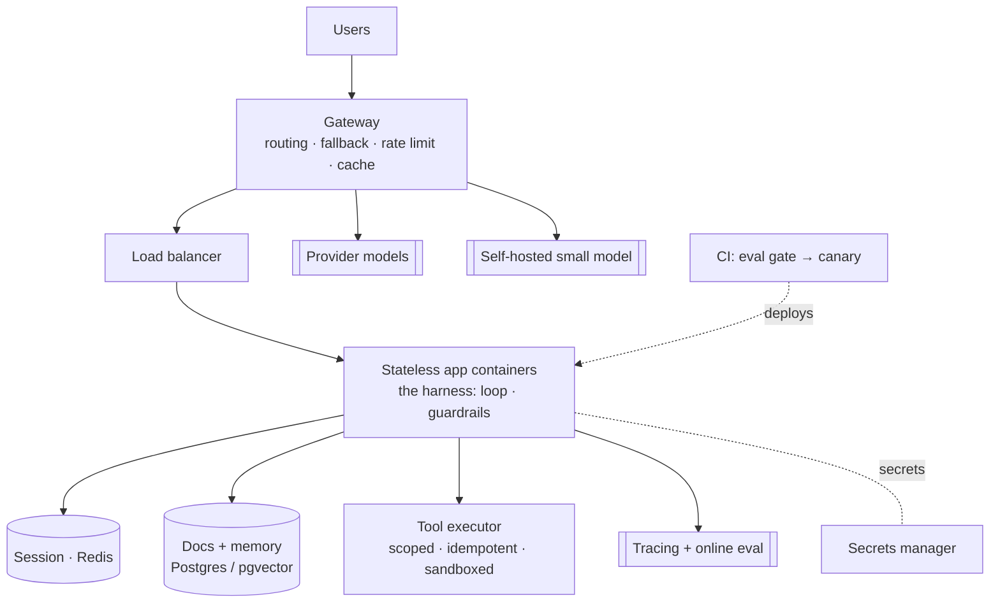

# Chapter 15 — Ship it: build and deploy

*Part V of the guide, and the payoff. Everything we've built, wired into one
production architecture, with an ordered path you could follow starting tomorrow.*

*Copilot status: designed, understood, and about to go live for real.*

---

## The whole system, on one page

Every piece from the guide, assembled:

Read it and you can see the entire guide: the **harness** loop (Ch 5) in stateless
containers, **session and memory** externalized (Ch 8), the **tool** boundary (Ch
6), **retrieval** in the vector store (Ch 3), a **gateway** for routing/fallback/
cost (Ch 11/13), **guardrails and the trifecta** controls (Ch 12), **tracing and
eval** (Ch 10/11), and a **CI eval gate with canary** deploys.

## The minimal real stack

You don't need most of a platform to start. This is enough to serve real users:

- **API + harness** — one stateless service, the ~150-line loop (Ch 5). No agent
  framework until you need durable execution or multi-agent (Ch 7/8).
- **Model access via a thin gateway** — even wrapping one provider, so retries,
  fallback, caching, and cost caps live in one place (Ch 11).
- **Session store** — Redis with a TTL (Ch 5/8).
- **Docs + memory** — one Postgres with `pgvector` for both retrieval and
  long-term memory; split later if volume forces it (Ch 3/8).
- **Prompt + model registry** — versioned in the repo, **pinned together** (Ch 1/2).
- **Guardrails** — input screening + strict output validation (Ch 12).
- **Tracing** — structured span per step; a real tool when you can (Ch 11).
- **Eval harness** — a curated set and a CI gate before any of this ships (Ch 10).

## Deploy it: the shape that scales

- **Stateless containers behind a load balancer.** All state is external, so add
  replicas to scale (Ch 8). Secrets (API keys) come from a secrets manager, never
  the image.
- **Autoscale on concurrency, not CPU.** Requests spend their lives *waiting* on
  the model; scale on in-flight requests or queue depth (Ch 5/11).
- **Queue + priority lanes in front.** Respect provider rate limits; user-facing
  requests jump ahead of background jobs (Ch 1/11).
- **Ship changes as canaries.** A one-word prompt edit can regress quality with no
  error — roll to a traffic slice, watch evals and cost, then widen (Ch 2/10).

## From zero to deployed, in order

A concrete sequence you could start tomorrow:

1. **Define the task and the cost of being wrong.** This decides your approval
   gates and permissions (Ch 14).
2. **Build the smallest workflow that could work** — often just retrieve →
   generate → cite. Don't reach for an agent yet (Ch 7).
3. **Stand up retrieval** — ingest, chunk, embed, index; measure recall@k before
   touching the prompt (Ch 3).
4. **Wrap the model** in the gateway with timeout, retry+jitter, fallback, and a
   cost cap (Ch 11).
5. **Write the eval set and the CI gate** *now*, from real examples — before you
   iterate (Ch 10).
6. **Add tools only when the task needs action**, behind the validate→authorize→
   execute boundary with idempotency keys (Ch 6).
7. **Upgrade one step to a capped agent loop** only if steps aren't enumerable;
   keep the step cap and approval gates (Ch 7).
8. **Externalize session and memory**; add checkpointing if runs are long (Ch 8).
9. **Threat-model with the trifecta**; scope tools, restrict egress, isolate
   tenants (Ch 12).
10. **Instrument everything**; deploy stateless containers with a canary and
    spend/drift alerts (Ch 11).
11. **Close the flywheel** — production failures become new eval cases and
    fine-tuning data (Ch 4/10).

## Day-2: keeping it alive

Shipping is the start. Running it means an **on-call runbook** for the LLM-specific
incident classes (provider outage → fallback; silent drift → roll back the pinned
version; cost spike → find the loop; injection → contain and revoke the tool path
— Ch 11/12), a recurring **cost review** against traces, and a steadily **growing
eval set** that makes every future change safer than the last. The system should
get *more* reliable over time, because the flywheel compounds.

## The one idea, one last time

We started with a sentence: *you've taken a dependency on something
non-deterministic, expensive, rate-limited, occasionally unavailable, and silently
replaced by its vendor.* Every chapter was a consequence of it — evaluation
because it's non-deterministic, cost controls and routing because it's expensive,
queues and fallbacks because it's rate-limited and flaky, version pinning and
drift alarms because it's replaced under you, and trust boundaries because it can
be tricked. Hold that frame and you can build and operate any of this. The Copilot
was just one instance; the judgment transfers.

That's the whole guide. Read it to understand; drill the
[card files](../a00-index.md) to remember; then go build something small,
end to end — a single real system with a real eval set will teach you more than
any amount of reading.

---

### Drill this
This chapter draws on the whole track; the closest card sets are
[A8 · Production Reliability](../a08-production-reliability.md) and
[A13 · Interview Playbook](../a13-agentic-interview-playbook.md).
